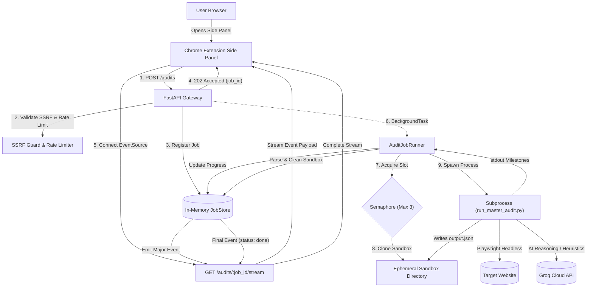
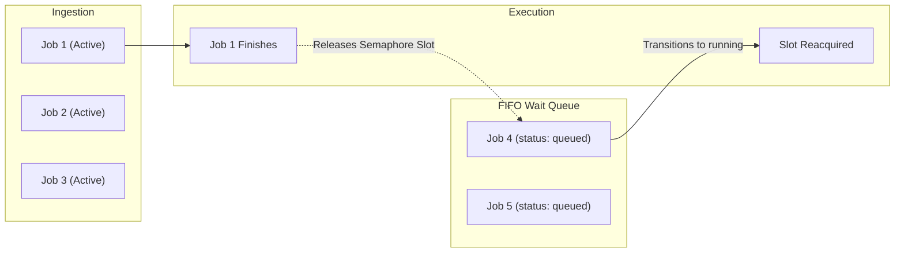
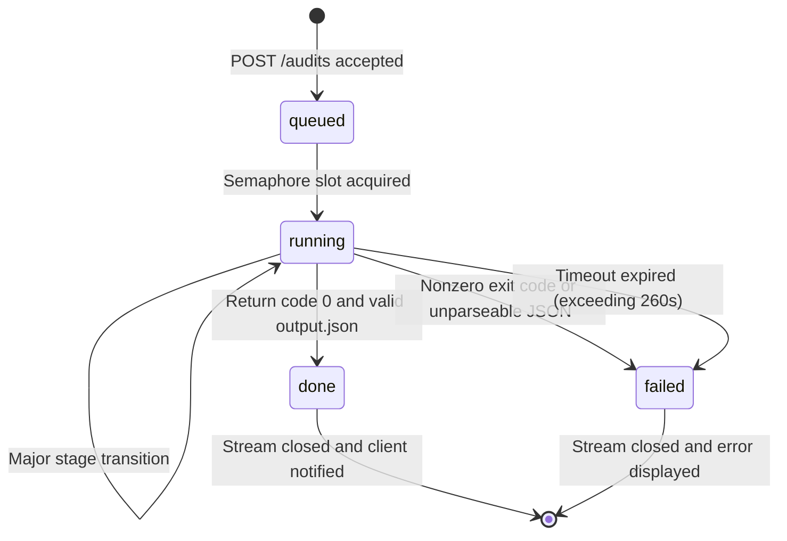

# WebLens — System Architecture & Background Job Execution

This document details the production architecture, background job execution model, sandbox isolation guarantees, Server-Sent Events (SSE) protocol, and failure resilience mechanisms implemented in WebLens.

---

## 1. System Overview & Architecture

WebLens upgrades an offline Python audit pipeline (`agent/`) into an asynchronous, distributed-ready architecture consisting of:
1. **Manifest V3 Chrome Extension:** Side panel interface providing active tab synchronization, credential management, real-time stage progress, and interactive findings triage.
2. **FastAPI Asynchronous Gateway (`backend/`):** REST API with non-blocking job acceptance, sliding-window rate limiting, and SSRF filtering.
3. **Subprocess Isolation Engine (`job_runner.py`):** Sandboxed subprocess-per-job worker executing multi-page Playwright Chromium crawls without modifying read-only agent files.
4. **Server-Sent Events (SSE) Event Stream:** Persistent, event-driven unidirectional channel emitting updates strictly upon major lifecycle milestones.



---

## 2. End-to-End Background Job Lifecycle

### Phase 1: Request Acceptance & Non-Blocking Handshake
1. The user clicks **"Audit This Page"** in the Chrome Extension side panel.
2. The side panel makes an HTTP `POST /audits` request containing:
   ```json
   {
     "url": "https://example.com",
     "groq_api_key": "gsk_..."
   }
   ```
3. **SSRF Guard Validation (`ssrf_guard.py`):**
   - Resolves DNS addresses synchronously and blocks RFC-1918 private subnets (`10.0.0.0/8`, `172.16.0.0/12`, `192.168.0.0/16`), loopback (`127.0.0.0/8`, `::1`), link-local/cloud metadata (`169.254.169.254`), and dangerous protocols (`file://`, `gopher://`, `ftp://`).
4. **Sliding Window Rate Limiter (`rate_limiter.py`):**
   - Checks client threshold (default: 15 requests per 10 minutes keyed by `X-Install-ID`).
5. **Job Record Initialization:**
   - A UUID `job_id` is generated and saved in `JobStore` with status `"queued"`.
6. **Instant Response:**
   - FastAPI dispatches `job_runner.run_job` via `BackgroundTasks` and immediately returns `HTTP 202 Accepted` in under 5 milliseconds.

---

### Phase 2: In-Memory FIFO Job Queue & Sandbox Isolation

#### In-Memory FIFO Job Queue Architecture
WebLens implements an **asynchronous FIFO job queue** governed by an `asyncio.Semaphore(MAX_CONCURRENT_JOBS)` (default: 3 concurrent jobs) per PRD §3.1 and §5 (no external Redis/RabbitMQ queue required for v1).



- **Waiters Queue:** When active jobs reach the concurrency cap (3), subsequent requests pause at `async with self.semaphore:`.
- **Status Reporting:** While waiting, the job's record in `JobStore` remains `"status": "queued"`. The SSE stream reports `"queued"` to the extension side panel so the user knows they are waiting in line.
- **Fair FIFO Wake-up:** The `asyncio` event loop maintains a FIFO queue of waiting coroutines. When an active job exits its `finally:` block and releases its slot, the earliest queued job automatically wakes up, updates to `"status": "running"`, and begins execution.
- **V2 Upgrade Path:** For multi-server horizontal scaling, this in-memory queue can be swapped for a distributed message broker (Redis + Arq or Celery) without altering the frontend REST or SSE interface.

#### Sandbox Isolation Sequence
To honor the strict requirement:
> *"agent/ is strictly read-only. Do not edit, patch, fork, or restructure anything inside it."*

The original pipeline hardcodes writing output to `os.path.join(WORKSPACE_ROOT, "output.json")` where `WORKSPACE_ROOT = os.path.dirname(__file__)`. If concurrent requests ran in a single process or shared directory, `output.json` would experience immediate write-collision and corrupt reports.

**Isolation Sequence:**
1. **Semaphore Gating:** `job_runner.py` enforces `asyncio.Semaphore(MAX_CONCURRENT_JOBS)` (default: 3 concurrent jobs) to prevent CPU and memory exhaustion.
2. **Ephemeral Directory Creation:** Generates a temporary directory:
   ```
   tempfile.mkdtemp(prefix="weblens_<job_id>_")
   ```
3. **Atomic Copy (under 15ms):** Copies the pristine `agent/` folder into `<temp_dir>/agent`.
4. **Environment Isolation:** Constructs a sanitized child process environment:
   - Sets `child_env["GROQ_API_KEY"] = clean_key` *only* inside the child process. The key never leaks into the parent process or persistent logs.
   - Sets `PYTHONUNBUFFERED=1` and `PYTHONIOENCODING=utf-8`.

---

### Phase 3: Subprocess Execution & Windows Loop Safety

On Windows, standard `asyncio.create_subprocess_exec` raises `NotImplementedError` when Uvicorn operates under the `SelectorEventLoop`.

**Solution:**
WebLens executes the worker in an OS-agnostic thread via `asyncio.to_thread(_run_subprocess_worker, ...)`:
- Invokes Python's standard `subprocess.Popen([sys.executable, "run_master_audit.py", target_url], cwd=temp_agent_dir)`.
- Spawns two background daemon reader threads for non-blocking line-by-line streaming of `stdout` and `stderr`.
- Enforces a **260-second hard execution ceiling**. If a run hangs, the process tree is terminated, and the job is marked `"failed"`.

---

### Phase 4: Server-Sent Events (SSE) Stream Protocol

Instead of high-frequency polling (`setInterval` / `chrome.alarms`) which causes browser tab freezes and Manifest V3 channel errors, updates stream via `GET /audits/{job_id}/stream`.

#### Major Lifecycle Events Filter
To conserve network and rendering overhead, events are emitted **strictly when a major milestone occurs**:
`if current_status != last_status or current_stage != last_stage:`

| Stage ID | Progress % | Detected Stdout Trigger | Activity Description |
| :--- | :--- | :--- | :--- |
| `starting` | 5% | Worker launch | Initializing isolated sandbox |
| `crawling` | 15% | Subprocess start | Launching Chromium & discovering subpages |
| `init` | 10% | `"master website audit execution for"` | Audit modules initialized |
| `diagnostic`| 20% | `"[llm diagnostic]"` | Verifying Groq / OpenAI LLM round-trip |
| `crawled` | 40% | `"crawl-render audit report"` | Completed crawl & DOM hydration analysis |
| `domain_skills`| 60% | `"[modules 2-5/5] executing per-page audit"` | Engagement, Accessibility & Multimodal skills |
| `aggregating`| 80% | `"findings across pages"` | Aggregating findings & gating evidence tiers |
| `finalizing` | 95% | `"audit completed in"` | Synthesizing standardized final report |
| `complete` | 100% | `output.json` parsed | Final report synthesized (Stream finishes) |

#### SSE Payload Schema
```json
data: {
  "job_id": "48d1d1ca-7ca8-49d3-91f9-0e304f4f11a7",
  "status": "running",
  "progress": {
    "stage": "domain_skills",
    "percent": 60,
    "message": "Running Engagement, Multimodal & Accessibility skills..."
  },
  "result": null,
  "error": null
}
```

When status reaches `"done"`, `result` contains the full canonical audit JSON and the server terminates the stream.

---

### Phase 5: Finalization & Teardown

1. `run_master_audit.py` finishes and writes canonical findings to `<temp_agent_dir>/output.json`.
2. `job_runner.py` reads and validates `output.json`.
3. `job_store` is updated:
   - `status = "done"`
   - `result = report_data`
   - `finished_at = <ISO-8601 timestamp>`
4. The final SSE event is dispatched with full report payloads.
5. In a `finally:` block:
   - Ephemeral directory `<temp_dir>` is securely deleted (`shutil.rmtree`).
   - The semaphore slot is released for the next queued job.

---

## 3. State Transition Model



---

## 4. Key Architectural Guarantees

| Concern | Implementation Mechanism | Guarantee |
| :--- | :--- | :--- |
| **Agent Immutability** | Byte-for-byte copy into per-job temporary sandbox | Zero modifications or restructuring of `agent/` codebase. |
| **Secret Hygiene** | `SecretSanitizingFilter` regex masking on all loggers | Groq API keys (`gsk_...`) never appear in logs, error traces, or stored records. |
| **SSRF Prevention** | Pre-flight DNS resolution & IP blocklisting | Blocks attacks against `localhost`, AWS metadata, cloud VPCs, and non-HTTP schemes. |
| **Crash-Free Monitoring**| Native `EventSource` (SSE) with stage diff gating | Replaces polling loops; emits ~8 events per audit instead of hundreds of poll requests. |
| **Deterministic Fallback**| Fail-soft qualitative heuristics | Pipeline generates full reports even when LLM keys are absent, expired, or offline. |
