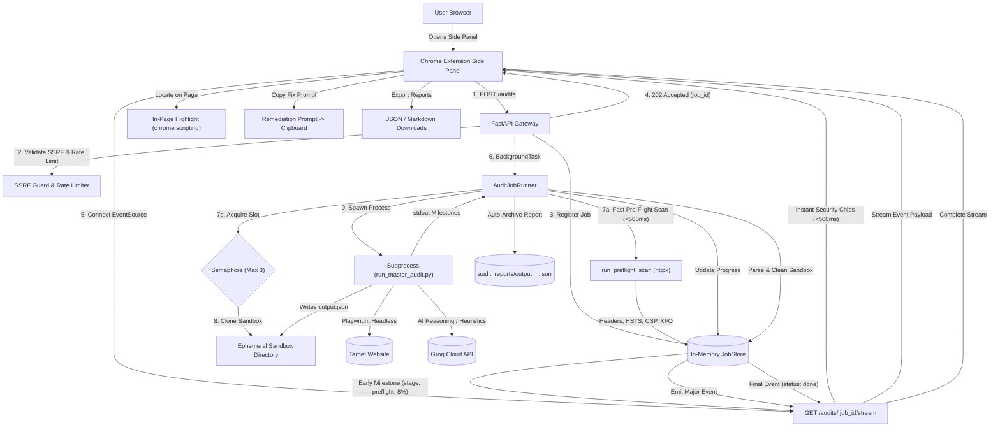
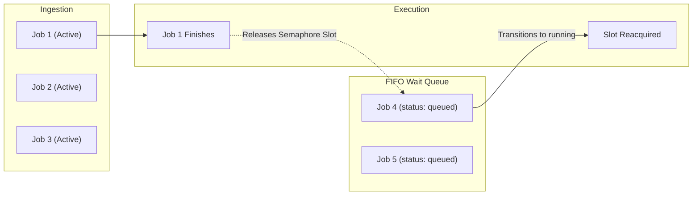
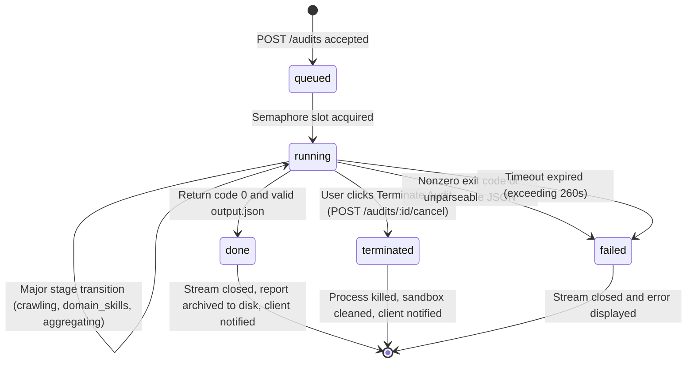

# WebLens — System Architecture & Background Job Execution

This document details the production architecture, background job execution model, sandbox isolation guarantees, Server-Sent Events (SSE) protocol, evidence parsing and normalization engine, and failure resilience mechanisms implemented in WebLens.

---

## 1. System Overview & Architecture

WebLens upgrades an offline Python audit pipeline (`agent/`) into an asynchronous, distributed-ready architecture consisting of:
1. **Manifest V3 Chrome Extension:** Side panel interface providing active tab synchronization, parallel audit tab management, instant pre-flight telemetry, real-time stage progress, interactive in-page element highlighting, 1-click AI fix prompt generation, and report exports.
2. **FastAPI Asynchronous Gateway (`backend/`):** REST API with non-blocking job acceptance, sliding-window rate limiting, SSRF filtering, and in-flight job cancellation (`POST /audits/{job_id}/cancel`).
3. **Instant Pre-Flight Scanner (`run_preflight_scan`):** Sub-500ms asynchronous HTTP security and header inspector emitting HSTS, CSP, X-Frame-Options, MIME sniffing (`nosniff`), cache control, and HTTP/2 metrics before Chromium launches.
4. **Subprocess Isolation Engine (`job_runner.py`):** Sandboxed subprocess-per-job worker executing multi-page Playwright Chromium crawls without modifying read-only agent files.
5. **Server-Sent Events (SSE) Event Stream:** Persistent, event-driven unidirectional channel emitting updates strictly upon major lifecycle milestones.
6. **Local Archival & Export Subsystem (`audit_reports/`):** Automated persistence of canonical audit results to timestamped JSON archives and one-click JSON/Markdown executive summary exports.
7. **Structured Evidence Normalization Engine:** Resilient client-side lexer (`pyToJson`) and pattern dispatcher converting raw Python telemetry and complex data structures into interactive route badges, stat chips, and editorial callout cards.


```mermaid
flowchart TD
    User["User Browser"] -->|"Opens Side Panel"| Ext["Chrome Extension Side Panel"]
    Ext -->|"1. POST /audits"| API["FastAPI Gateway"]
    API -->|"2. Validate SSRF & Rate Limit"| Guard["SSRF Guard & Rate Limiter"]
    API -->|"3. Register Job"| Store[("In-Memory JobStore")]
    API -->|"4. 202 Accepted (job_id)"| Ext
    
    Ext -->|"5. Connect EventSource"| SSE["GET /audits/:job_id/stream"]
    
    API -.->|"6. BackgroundTask"| Runner["AuditJobRunner"]
    Runner -->|"7a. Fast Pre-Flight Scan (<500ms)"| Preflight["run_preflight_scan (httpx)"]
    Preflight -->|"Headers, HSTS, CSP, XFO"| Store
    Store -->|"Early Milestone (stage: preflight, 8%)"| SSE
    SSE -->|"Instant Security Chips (<500ms)"| Ext

    Runner -->|"7b. Acquire Slot"| Sem{"Semaphore (Max 3)"}
    Sem -->|"8. Clone Sandbox"| Sandbox["Ephemeral Sandbox Directory"]
    Runner -->|"9. Spawn Process"| Sub["Subprocess (run_master_audit.py)"]
    
    Sub -->|"Playwright Headless"| Web[("Target Website")]
    Sub -->|"AI Reasoning / Heuristics"| Groq[("Groq Cloud API")]
    
    Sub -->|"stdout Milestones"| Runner
    Runner -->|"Update Progress"| Store
    Store -->|"Emit Major Event"| SSE
    SSE -->|"Stream Event Payload"| Ext
    
    Sub -->|"Writes output.json"| Sandbox
    Runner -->|"Parse & Clean Sandbox"| Store
    Runner -->|"Auto-Archive Report"| Archive[("audit_reports/output_<id>_<time>.json")]
    Store -->|"Final Event (status: done)"| SSE
    SSE -->|"Complete Stream"| Ext

    Ext -->|"Locate on Page"| DOM["In-Page Highlight (chrome.scripting)"]
    Ext -->|"Copy Fix Prompt"| Clip["Remediation Prompt -> Clipboard"]
    Ext -->|"Export Reports"| Files["JSON / Markdown Downloads"]
```

---

## 2. End-to-End Background Job Lifecycle

### Phase 1: Request Acceptance & Non-Blocking Handshake
1. The user clicks **"Audit This Page"** in the Chrome Extension side panel (or opens a parallel tab in the side panel).
2. The side panel makes an HTTP `POST /audits` request containing:
   ```json
   {
     "url": "https://example.com",
     "groq_api_key": "gsk_..."
   }
   ```
3. **SSRF Guard Validation (`ssrf_guard.py`):**
   - Resolves DNS addresses synchronously and blocks RFC-1918 private subnets (`10.0.0.0/8`, `172.16.0.0/12`, `192.168.0.0/16`), loopback (`127.0.0.0/8`, `::1`), link-local/cloud metadata (`169.254.169.254`), and dangerous protocols (`file://`, `gopher://`, `ftp://`).
4. **Sliding Window Rate Limiter (`rate_limiter.py`):**
   - Checks client threshold (default: 15 requests per 10 minutes keyed by `X-Install-ID`).
5. **Job Record Initialization:**
   - A UUID `job_id` is generated and saved in `JobStore` with status `"queued"`.
6. **Instant Response:**
   - FastAPI dispatches `job_runner.run_job` via `BackgroundTasks` and immediately returns `HTTP 202 Accepted` in under 5 milliseconds.

---

### Phase 1b: Instant Pre-Flight Security & Header Scan (< 500ms)
Before acquiring a concurrency semaphore slot and before Playwright boots headless Chromium (which typically takes 2–5 seconds), `AuditJobRunner` executes a lightweight asynchronous network probe:
1. `run_preflight_scan(url)` executes via `httpx.AsyncClient(timeout=4.0, follow_redirects=True)` using `HEAD` with fallback to `GET` (range 0–1024 bytes).
2. Inspects key security and protocol headers:
   - **HSTS:** `Strict-Transport-Security` presence.
   - **CSP:** `Content-Security-Policy` presence.
   - **Clickjacking Protection:** `X-Frame-Options` directive (`DENY`, `SAMEORIGIN`).
   - **MIME Sniffing:** `X-Content-Type-Options: nosniff`.
   - **Caching & Performance:** `Cache-Control`, `ETag`, `Server` banner, and HTTP version (`HTTP/2` vs `1.1`).
   - Computes a 0–100 **Security Score**.
3. Telemetry is immediately saved to `JobStore` and emitted over SSE (`stage: "preflight"`, `percent: 8`).
4. The user sees security badges and header evaluation in under 500ms, providing instant perceived value while the deep crawler initializes.

---

### Phase 2: In-Memory FIFO Job Queue & Sandbox Isolation

#### In-Memory FIFO Job Queue Architecture
WebLens implements an **asynchronous FIFO job queue** governed by an `asyncio.Semaphore(MAX_CONCURRENT_JOBS)` (default: 3 concurrent jobs) per PRD §3.1 and §5 (no external Redis/RabbitMQ queue required for v1).


```mermaid
flowchart LR
    subgraph Ingestion
        R1["Job 1 (Active)"]
        R2["Job 2 (Active)"]
        R3["Job 3 (Active)"]
    end
    subgraph "FIFO Wait Queue"
        Q1["Job 4 (status: queued)"]
        Q2["Job 5 (status: queued)"]
    end
    subgraph Execution
        R1 --> Fin["Job 1 Finishes"]
        Fin -.->|"Releases Semaphore Slot"| Q1
        Q1 -->|"Transitions to running"| Act["Slot Reacquired"]
    end
```

- **Waiters Queue:** When active jobs reach the concurrency cap (3), subsequent requests pause at `async with self.semaphore:`.
- **Status Reporting:** While waiting, the job's record in `JobStore` remains `"status": "queued"`. The SSE stream reports `"queued"` to the extension side panel so the user knows they are waiting in line.
- **Fair FIFO Wake-up:** The `asyncio` event loop maintains a FIFO queue of waiting coroutines. When an active job exits its `finally:` block and releases its slot, the earliest queued job automatically wakes up, updates to `"status": "running"`, and begins execution.
- **V2 Upgrade Path:** For multi-server horizontal scaling, this in-memory queue can be swapped for a distributed message broker (Redis + Arq or Celery) without altering the frontend REST or SSE interface.

#### Sandbox Isolation Sequence
To honor the strict requirement:
> *"agent/ is strictly read-only. Do not edit, patch, fork, or restructure anything inside it."*

The original pipeline hardcodes writing output to `os.path.join(WORKSPACE_ROOT, "output.json")` where `WORKSPACE_ROOT = os.path.dirname(__file__)`. If concurrent requests ran in a single process or shared directory, `output.json` would experience immediate write-collision and corrupt reports.

**Isolation Sequence:**
1. **Semaphore Gating:** `job_runner.py` enforces `asyncio.Semaphore(MAX_CONCURRENT_JOBS)` (default: 3 concurrent jobs) to prevent CPU and memory exhaustion.
2. **Ephemeral Directory Creation:** Generates a temporary directory:
   ```
   tempfile.mkdtemp(prefix="weblens_<job_id>_")
   ```
3. **Atomic Copy (under 15ms):** Copies the pristine `agent/` folder into `<temp_dir>/agent`.
4. **Environment Isolation:** Constructs a sanitized child process environment:
   - Sets `child_env["GROQ_API_KEY"] = clean_key` *only* inside the child process. The key never leaks into the parent process or persistent logs.
   - Sets `PYTHONUNBUFFERED=1` and `PYTHONIOENCODING=utf-8`.

---

### Phase 3: Subprocess Execution & Windows Loop Safety

On Windows, standard `asyncio.create_subprocess_exec` raises `NotImplementedError` when Uvicorn operates under the `SelectorEventLoop`.

**Solution:**
WebLens executes the worker in an OS-agnostic thread via `asyncio.to_thread(_run_subprocess_worker, ...)`:
- Invokes Python's standard `subprocess.Popen([sys.executable, "run_master_audit.py", target_url], cwd=temp_agent_dir)`.
- Spawns background daemon reader threads for non-blocking line-by-line streaming of `stdout` and `stderr`.
- Enforces a **260-second hard execution ceiling**. If a run hangs, the process tree is terminated, and the job is marked `"failed"`.

---

### Phase 4: Server-Sent Events (SSE) Stream Protocol

Instead of high-frequency polling (`setInterval` / `chrome.alarms`) which causes browser tab freezes and Manifest V3 channel errors, updates stream via `GET /audits/{job_id}/stream`.

#### Major Lifecycle Events Filter
To conserve network and rendering overhead, events are emitted **strictly when a major milestone occurs**:
`if current_status != last_status or current_stage != last_stage:`

| Stage ID | Progress % | Detected Stdout Trigger | Activity Description |
| :--- | :--- | :--- | :--- |
| `starting` | 5% | Worker launch | Initializing isolated sandbox |
| `preflight` | 8% | Pre-flight completion | Sub-500ms security headers evaluation |
| `crawling` | 15% | Subprocess start | Launching Chromium & discovering subpages |
| `init` | 10% | `"master website audit execution for"` | Audit modules initialized |
| `diagnostic`| 20% | `"[llm diagnostic]"` | Verifying Groq / OpenAI LLM round-trip |
| `crawled` | 40% | `"crawl-render audit report"` | Completed crawl & DOM hydration analysis |
| `domain_skills`| 60% | `"[modules 2-5/5] executing per-page audit"` | Engagement, Accessibility & Multimodal skills |
| `aggregating`| 80% | `"findings across pages"` | Aggregating findings & gating evidence tiers |
| `finalizing` | 95% | `"audit completed in"` | Synthesizing standardized final report |
| `complete` | 100% | `output.json` parsed | Final report synthesized (Stream finishes) |

#### SSE Payload Schema
```json
data: {
  "job_id": "48d1d1ca-7ca8-49d3-91f9-0e304f4f11a7",
  "status": "running",
  "progress": {
    "stage": "domain_skills",
    "percent": 60,
    "message": "Running Engagement, Multimodal & Accessibility skills..."
  },
  "preflight": {
    "scanned": true,
    "status_code": 200,
    "http_version": "HTTP/2",
    "hsts": true,
    "csp": true,
    "x_frame_options": "DENY",
    "x_content_type_options": "nosniff",
    "cache_control": "public, max-age=3600",
    "etag": true,
    "server": "cloudflare",
    "security_score": 100,
    "highlights": []
  },
  "result": null,
  "error": null
}
```

When status reaches `"done"`, `result` contains the full canonical audit JSON and the server terminates the stream.

---

### Phase 4b: Job Cancellation & User Termination Protocol
Users can terminate an in-flight audit at any time by clicking **"Terminate Audit"** in the Side Panel:
1. Extension issues `POST /audits/{job_id}/cancel`.
2. Gateway tears down active EventSource streams.
3. `AuditJobRunner` terminates the underlying Chromium subprocess tree immediately.
4. Ephemeral sandbox directories are pruned and the job status transitions to `"terminated"`.

---

### Phase 5: Finalization, Archival & Teardown

1. `run_master_audit.py` finishes and writes canonical findings to `<temp_agent_dir>/output.json`.
2. `job_runner.py` reads and validates `output.json`.
3. **Local Disk Auto-Archiving:**
   - Copies canonical report to `audit_reports/output.json`.
   - Creates an immutable timestamped archive: `audit_reports/output_<job_id[:8]>_<timestamp>.json`.
   - Ensures historical audits are safely persisted on disk without modifying `agent/`.
4. `job_store` is updated:
   - `status = "done"`
   - `result = report_data`
   - `finished_at = <ISO-8601 timestamp>`
5. The final SSE event is dispatched with full report payloads.
6. In a `finally:` block:
   - Ephemeral directory `<temp_dir>` is securely deleted (`shutil.rmtree`).
   - The semaphore slot is released for the next queued job.

---

## 3. Presentation Layer & Evidence Normalization Engine

### Multi-Tab Parallel Audit Management
The Chrome Extension Side Panel supports parallel audits using a browser-tab-like strip (`#audit-tabs`):
- Each audited URL spawns an independent job tab with a live status dot (`dot-running`, `dot-done`, `dot-failed`).
- Users can switch between tabs without interrupting background crawling or SSE telemetry.
- Finished tabs feature close buttons (`×`) to free session storage.

### Resilient Python-to-JSON Lexer (`pyToJson`)
Evidence emitted by multi-page agent skills often contains stringified Python data structures (`dict`, `list`, `True`, `False`, `None`, and single-quoted strings). Standard `JSON.parse(str.replace(/'/g, '"'))` fails when values contain English apostrophes (e.g. `Nor'easter`, `Miller's Law`, `img-002's`).

WebLens incorporates a dedicated tokenizer in [`side_panel.js`](file:///C:/Users/rg060/Desktop/Work/Website/Hackathon/Web%20Lens/WebLens/extension/side_panel.js):
- Respects string boundaries (`'`, `"`) and escape characters (`\'`, `\"`, `\\`), preserving apostrophes inside values.
- Converts bare Python literals (`True` -> `true`, `False` -> `false`, `None` -> `null`) without regex text corruption.
- Parses nested dicts and lists safely into native JavaScript objects.

### Multi-Pattern Evidence Dispatcher
The `renderEvidence` engine categorizes and renders evidence into structured UI components:

```
finding.evidence Input
  ├── Direct URL Block: URL '<url>' (<page_type>): <dict>
  │     └── Renders Route Type Badge + Clickable Page Link + Labeled Stat Chips
  ├── Multi-Page Rollup: Audited N pages... Sample telemetry: <list>
  │     └── Renders Prose Summary + Clean Telemetry Bullet List (no raw bracket syntax)
  ├── Parenthetical Metadata: ... (nav_item_count: 20; items: [...])
  │     └── Renders Semicolon-delimited Key Chips + Interactive Nav Link Pills
  ├── Qualitative Critique: {'qualitative_critique': '...'}
  │     └── Renders Styled Editorial Callout Quote Box
  ├── Legacy DOM Comparator: (source: ..., field: ..., value: ..., details: ...)
  │     └── Renders Structured Evidence Table (Source, Field, Value chips, Details chips)
  └── Text with URLs:
        └── Auto-linkifies embedded URLs for 1-click inspection
```

### Live In-Page Element Highlighting
Users can inspect offending elements on the live webpage by clicking **"Locate on Page"** on any finding card:
1. Side Panel queries the active browser tab via `chrome.tabs.query`.
2. Executes an in-page DOM script via `chrome.scripting.executeScript`.
3. Targets elements using multiple heuristics:
   - CSS selectors extracted from finding evidence.
   - Missing-alt and defective images (`img:not([alt])`, `img[alt=""]`).
   - Headings (`h1`, `h2`), buttons/CTAs (`[role="button"]`, `.btn`), links (`a[href]`), and form controls.
   - Quoted text snippet matching.
4. **Visual Highlights:**
   - Scrolls the element into center view (`scrollIntoView({ behavior: 'smooth', block: 'center' })`).
   - Injects a pulsating glowing outline (`#weblens-highlight-overlay`) with a floating dismissal badge.
   - Displays a top notification banner if the finding is page-wide or HTTP-header level.

### AI Remediation Prompt Engineering
Finding cards feature a **"Copy AI Fix Prompt"** button:
- Compiles an engineered remediation prompt with Finding ID, Title, Severity, Evidence Tier, Diagnostic Data, Suggested Action, and Task Instructions.
- Formatted in Markdown ready to paste into Cursor, Claude, ChatGPT, or GitHub Copilot.
- Transitions to a green `✓ Copied Prompt!` feedback state.

### One-Click Report Exports
- **Export JSON:** Generates and downloads canonical `weblens-audit-<domain>-<date>.json`.
- **Export Markdown:** Generates an executive Markdown report with target metadata, pre-flight security table, executive metrics matrix, and categorized findings with remediation tasks.

---

## 4. State Transition Model


```mermaid
stateDiagram-v2
    [*] --> queued: POST /audits accepted
    queued --> running: Semaphore slot acquired
    running --> running: Pre-flight scan (<500ms)
    running --> running: Major stage transition (crawling, domain_skills, aggregating)
    
    running --> done: Return code 0 and valid output.json
    running --> terminated: User clicks Terminate Audit (POST /audits/:id/cancel)
    running --> failed: Nonzero exit code or unparseable JSON
    running --> failed: Timeout expired (exceeding 260s)
    
    done --> [*]: Stream closed, report archived to disk, client notified
    terminated --> [*]: Process killed, sandbox cleaned, client notified
    failed --> [*]: Stream closed and error displayed
```

---

## 5. Key Architectural Guarantees

| Concern | Implementation Mechanism | Guarantee |
| :--- | :--- | :--- |
| **Agent Immutability** | Byte-for-byte copy into per-job temporary sandbox | Zero modifications or restructuring of `agent/` codebase. |
| **Pre-Flight Speed** | Asynchronous `httpx` probe before Chromium launch | Returns security score, HSTS, CSP, and XFO badges in **under 500ms**. |
| **Secret Hygiene** | `SecretSanitizingFilter` regex masking on all loggers | Groq API keys (`gsk_...`) never appear in logs, error traces, or stored records. |
| **SSRF Prevention** | Pre-flight DNS resolution & IP blocklisting | Blocks attacks against `localhost`, AWS metadata, cloud VPCs, and non-HTTP schemes. |
| **Crash-Free Monitoring**| Native `EventSource` (SSE) with stage diff gating | Replaces polling loops; emits ~9 events per audit instead of hundreds of poll requests. |
| **User Control** | `POST /audits/{job_id}/cancel` + Process Tree Kill | In-flight jobs can be safely cancelled at any stage without orphan processes. |
| **Safe Evidence Tokenization** | Resilient `pyToJson` character-by-character lexer | Never breaks on English apostrophes (`Nor'easter`, `Miller's Law`); 100% clean parsing. |
| **Local Report Persistence** | Dual auto-archive to `audit_reports/` | Preserves canonical `output.json` and timestamped historical records permanently. |
| **Deterministic Fallback**| Fail-soft qualitative heuristics | Pipeline generates full reports even when LLM keys are absent, expired, or offline. |
